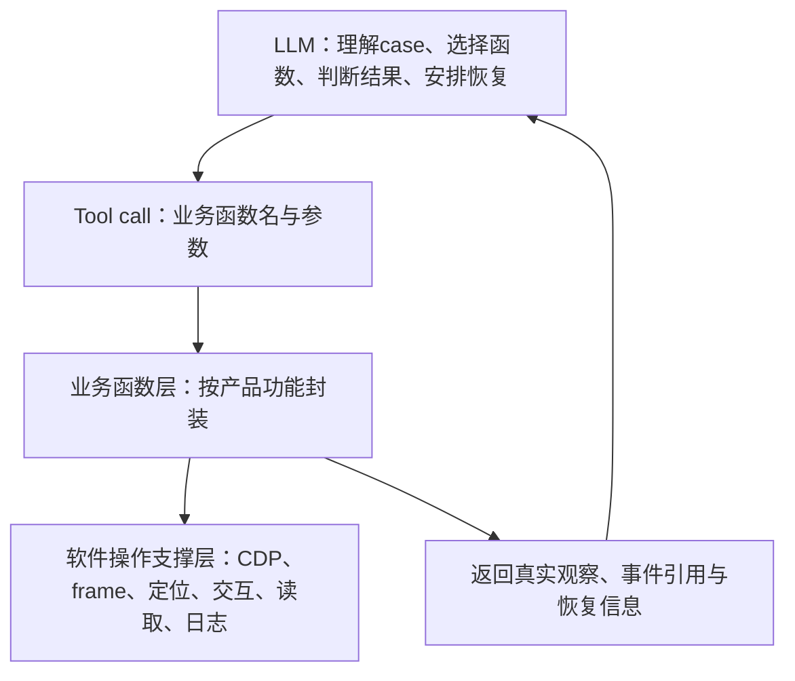

# 下一轮测试代码分层设计

**文档角色：设计参考。**文件名保留供旧链接使用，两层体系已经实现；执行者优先读 [当前工具入口](../tools/ui-operations/README.md)，需要设计背景或扩展函数时再读本页。下面的示例目录不要求重新建立一套实现。

适用范围：后续Agent测试任务。操作函数库已落在 [tools/ui-operations](../tools/ui-operations/README.md)，本文件说明两层职责；示例接口是否可用以catalog和验证记录为准。

## 一、调整后的结构

按用户修订，原“软件接入”和“页面/组件”合并为**软件操作支撑层**；原第三层命名为**业务函数层**。测试计划、函数选择、用例断言、结果判断和持续推进由LLM通过现有tool call完成。



已按下方两层落盘。LLM调用业务函数，函数内部调用软件操作支撑。目录按产品功能分级，不把所有函数放在同一文件中。

## 二、目录设计

```text
探索性测试/<下一轮任务>/
├─ README.md
├─ 用例/
│  ├─ cases.json                  # LLM读取的功能路径、操作与断言契约
│  └─ 场景说明.md                 # 共享准备、依赖与恢复
├─ code/
│  ├─ business/                   # 原层级3：tool call的业务函数
│  │  ├─ catalog.json             # 按功能分类的索引、函数契约位置
│  │  ├─ conversation/
│  │  │  ├─ tasks.mjs             # 新建、发送、等待终态
│  │  │  ├─ attachments.mjs       # 添加、预览、移除附件
│  │  │  └─ observations.mjs      # 最终正文、状态、Trace、产物读取
│  │  ├─ skills/
│  │  │  ├─ import.mjs            # 导入技能与反馈
│  │  │  ├─ manage.mjs            # 搜索、详情、启停
│  │  │  └─ use.mjs               # 选技能并调用，收集资源和输出
│  │  ├─ experts/
│  │  │  ├─ import.mjs            # 导入、冲突、副本
│  │  │  └─ use-edit.mjs          # 使用、编辑方案、确认与回读
│  │  └─ settings/
│  │     ├─ general.mjs           # 语言、主题、字号等业务操作
│  │     └─ recovery.mjs          # 按初值恢复并独立回读
│  ├─ automation/                 # 原层级1+2合并：软件操作支撑
│  │  ├─ session.mjs              # CDP连接、实例身份、连接生命周期
│  │  ├─ shell.mjs                # 主页面、导航、头像菜单
│  │  ├─ conversation.mjs         # composer、Trace等组件交互
│  │  ├─ skills.mjs               # 技能iframe、卡片、导入dialog
│  │  ├─ experts.mjs              # 专家iframe、详情与导入dialog
│  │  ├─ settings.mjs             # 设置dialog、分类、具体配置行
│  │  ├─ recorder.mjs             # 真实动作/读取、时间、来源与原值
│  │  ├─ evidence.mjs             # 截图、哈希、索引
│  │  └─ fixtures.mjs             # 本轮样本、对象归属、文件备份
│  ├─ call.mjs                    # 可选：对接现有tool的薄调用入口
│  └─ probes/                     # 函数能力缺口的发现/诊断代码，按功能归档
├─ 夹具/
├─ 运行日志/
├─ 证据/
├─ 结果/
└─ 审核/
   └─ 脚本索引.json               # 本轮实际使用函数、模块版本与SHA256
```

只创建实际需要的模块。小功能可以共用一个文件；功能变多后按二级功能拆分。业务函数命名表达产品能力，例如“导入技能”，case编号放在记录关联中。

## 三、业务函数是Agent的调用入口

LLM先查功能索引，再读取相关业务函数的完整契约。每个函数提供：

- 函数名、所属一级/二级功能、用途。
- 参数schema、必填项、取值范围、具体对象身份。
- 前置状态、适用产品版本/能力条件。
- 实际副作用、等待条件、超时和错误返回。
- 返回的真实数据、事件引用、恢复方式。
- 验证状态及实现路径/版本。

例如以下仅为接口设计：

| 函数 | 主要参数 | 返回的实际观察 |
|---|---|---|
| conversation.createTask | 已有项目ID、模型、推理等级 | 实际session id与composer状态 |
| conversation.sendMessage | session id、实际请求文本 | 提交事件、消息身份 |
| conversation.readResult | session id、终态等待上限 | 任务状态、助手原文、Trace资源、产物 |
| skills.importSkill | 本轮包路径、唯一内部name | 实际导入反馈、对象身份、初始启用态 |
| skills.setEnabled | skill id、目标开关值 | 改前/改后真实值、保存反馈 |
| skills.useSkill | skill id、实际请求、目标会话策略 | 实际会话ID、引用资源、Trace和回复 |
| experts.importExpert | 本轮目录、冲突处理方式 | 实际反馈、原对象与新增对象路径 |
| settings.setPreference | 配置key、目标值 | 初值、改后值、重开回读、错误提示 |
| settings.restorePreferences | 本轮初值快照/恢复凭据 | 独立回读值、恢复失败项与残留 |

同一业务函数可被多条case复用。函数可组合连续稳定操作，并返回多个观察值，减少LLM与tool往返。导航、dialog或控件变化后由内部支撑代码重新观察。

业务函数返回实际观察，LLM按case契约判定。函数可以报告“动作已提交”“保存被拒绝”“任务超时”，不能把tool调用正常返回直接写成case通过。精确值、计数、哈希比较可以使用通用比较函数辅助LLM；结果仍关联真实读取。

## 四、Tool call如何接入

优先将业务函数按名称和参数schema暴露到现有tool call机制。Agent看到的是业务能力与契约，接入层内部处理模块加载和执行上下文。

现有工具只能执行脚本时，可用一个薄调用入口将“函数名+参数”转发给业务模块，例如：

```text
函数：skills.importSkill
参数：packagePath、expectedInternalName
```

这里的expectedInternalName用于准确识别本轮对象，不用于构造实际返回值。调用入口负责校验参数、关联run/attempt、调用指定函数、返回结构化数据，不承担case队列编排或测试通过判定。当前命令与实际字段见 [调用与记录](../tools/ui-operations/docs/调用与记录.md)，本页示例接口不代替主库契约。

连接、实例身份、frame和日志对象由调用入口/操作支撑维护。LLM使用业务身份参数，不必在每次调用中复制CDP地址、CSS定位器或连接代码。

## 五、先复用，能力缺失时补代码

LLM执行case时遵循：

1. 按一级/二级功能查业务函数目录，确认参数、前置条件和适用范围。
2. 使用已有业务函数；多步业务可以组合现有函数。
3. 对照返回的真实值执行case断言，记录结论并安排恢复。
4. 找不到适用函数、且现有函数组合也不能覆盖所需操作时，再写代码补能力。
5. 新代码留在本任务目录；定位和底层交互进入automation，对外业务能力进入business，更新函数索引，注明“本轮新增、待审核”。

函数执行失败先保留原始错误与实际状态，按规则做有限诊断；不能绕开函数另写脚本后隐去原失败。需要修复函数时保留旧版本、原因和新attempt。缺入口可能是产品差异，也可能是定位不适配，不能一律当“缺函数”重复造代码。

probes保存发现过程。确认可用后把能力整理进相应模块，保留原probe及来源关系。不要让后续case持续依赖散落的临时探针。

## 六、职责与返回契约

软件操作支撑负责：连接、主页面/iframe定位、控件交互、实际状态读取、明确终态等待、原始日志和证据。业务函数负责：按产品语义组合这些能力，暴露可调用的参数化操作与读取。

每次业务函数调用返回：

```javascript
// 接口设计示意，尚非可运行实现。
{
  functionName: 'settings.setPreference',
  functionVersion: '实际函数版本',
  callId: '本次调用身份',
  environmentId: '实际环境身份',
  objectId: '实际配置字段/内部name/session id',
  operationStatus: '实际操作状态',
  observations: {
    initialValue: { value: '实际初值', readRefs: ['真实读事件ID'] },
    currentValue: { value: '实际回读值', readRefs: ['真实读事件ID'] },
    feedback: { value: '实际反馈原文', readRefs: ['真实读事件ID'] }
  },
  actionRefs: ['真实动作事件ID'],
  changedObjects: ['本轮改变的对象'],
  recovery: { /* 原值、备份身份、恢复所需参数 */ }
}
```

原始读事件保留限定表面、实际定位器、对象身份和取值来源；布尔聚合保存组成值与计算依据。返回数据不能从预期答案填充。对象不存在、拒绝、超时、无法读取分别说明，LLM据此处理业务失败和未观测断言。

## 七、设置语言例子

LLM执行“语言切English、验证并恢复”：

1. 调用settings读取语言初值，保存读事件与恢复参数。
2. 调用settings.setPreference修改语言并等待保存，返回真实回读与导航文字。
3. LLM按case明确断言比较实际语言、导航文字和重开回读值。
4. 调用settings.restorePreferences恢复初值，LLM检查独立回读与残留。
5. 关联每次函数调用、实现版本、原始读取和case结果。

automation/settings.mjs集中处理多语言定位、可见dialog、具体配置行及重开等待；业务函数复用这些能力。避免固定向上走若干层猜配置行，或全页搜索词汇当作目标菜单。

发生错误后LLM仍需安排恢复。函数返回的恢复凭据应足以继续恢复；恢复动作提交和恢复值正确分别记录。

## 八、留存、复盘与公共库

每次调用留存业务函数及实际调用的支撑模块，记录路径、版本、SHA256、参数（敏感信息脱敏）、环境、起止时间、事件引用、关联case和恢复结果。内联新增代码也保留源文件。连接返回正常或脚本退出码0不能代替断言成立。

函数修改保留旧版本与旧attempt；日志追加，关键证据保留。脚本索引覆盖本轮实际使用模块，按场景批量固化哈希，减少登记耗时。

复盘链为：case→LLM采用的调用与参数→业务函数版本→软件操作支撑→具体对象/动作/原始值→断言结论→恢复与残留。分别统计记录完整率和业务断言观测率。

新业务函数先留在任务待审目录。双方审核参数化程度、实际执行证据、定位与语言适配、失败处理和恢复后，再提取进公共函数库。公共库按产品功能分目录，提供渐进式索引；任务固定引用实际版本和哈希。

下一轮入口按“任务范围→功能树与case契约→测试规则→业务函数索引→所需函数契约”引导Agent。LLM继续负责测试执行决策和结果判定，优先tool call已有业务函数，能力缺失时补写并留存代码。
